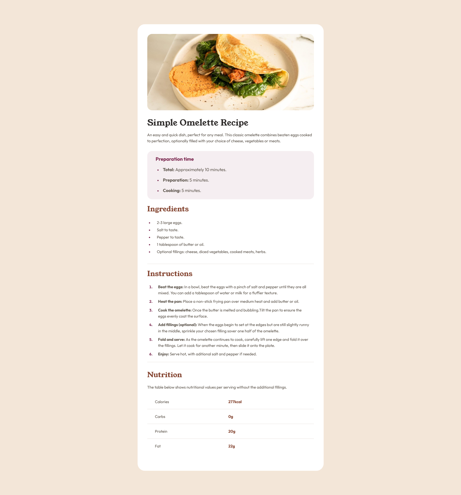

# Frontend Mentor - Recipe page solution

This is a solution to the [Recipe page challenge on Frontend Mentor](https://www.frontendmentor.io/challenges/recipe-page-KiTsR8QQKm). Frontend Mentor challenges help you improve your coding skills by building realistic projects.

## Table of contents

- [Overview](#overview)
  - [The challenge](#the-challenge)
  - [Screenshot](#screenshot)
  - [Links](#links)
- [My process](#my-process)
  - [Built with](#built-with)
  - [What I learned](#what-i-learned)
  - [Continued development](#continued-development)
  - [Useful resources](#useful-resources)
  - [AI Collaboration](#ai-collaboration)
- [Author](#author)
- [Acknowledgments](#acknowledgments)

## Overview

I built the Recipe Page, which is a Frontend Mentor challenge.

### Screenshot



### Links

- Solution URL: (https://github.com/Imnot343guiltyspark/Front-endMentor-Recipe-page)
- Live Site URL: (https://imnot343guiltyspark.github.io/Front-endMentor-Recipe-page/)

## My process

I started analyzing how the example was made, and then replicating block by block and styiling them. Sometimes got stuck in some issues but I did really good.

### Built with

- Semantic HTML5 markup
- CSS custom properties
- Flexbox
- Mobile-first workflow

### What I learned

I learned a new HTML tag, the table, and the <hr> tag to draw the lines that separate the blocks, and I learned how to style them.

```html
<div class="recipe-nutrition">
  <h2 class="recipe-nutrition__title">Nutrition</h2>
  <p class="recipe-nutrition__description">
    The table below shows nutritional values per serving without the additional
    fillings.
  </p>
  <table class="recipe-nutrition__facts">
    <tr>
      <th>Calories</th>
      <td><strong>277kcal</strong></td>
    </tr>
    <tr>
      <th>Carbs</th>
      <td><strong>0g</strong></td>
    </tr>
    <tr>
      <th>Protein</th>
      <td><strong>20g</strong></td>
    </tr>
    <tr>
      <th>Fat</th>
      <td><strong>22g</strong></td>
    </tr>
  </table>
</div>
```

```css
.recipe-nutrition {
  display: flex;
  flex-direction: column;
  align-items: stretch;
  gap: 2rem;
  margin: 3.2rem;
  text-align: left;
  color: var(--Stone-600);
  font-family: var(--body-text);
}
```

### AI Collaboration

I did use Claude as a former teacher, always telling me and teaching me the ways to do it not giving me a single line of code just pure iteration all by my self.

## Author

Frontend Mentor - @Imnot343guiltyspark
